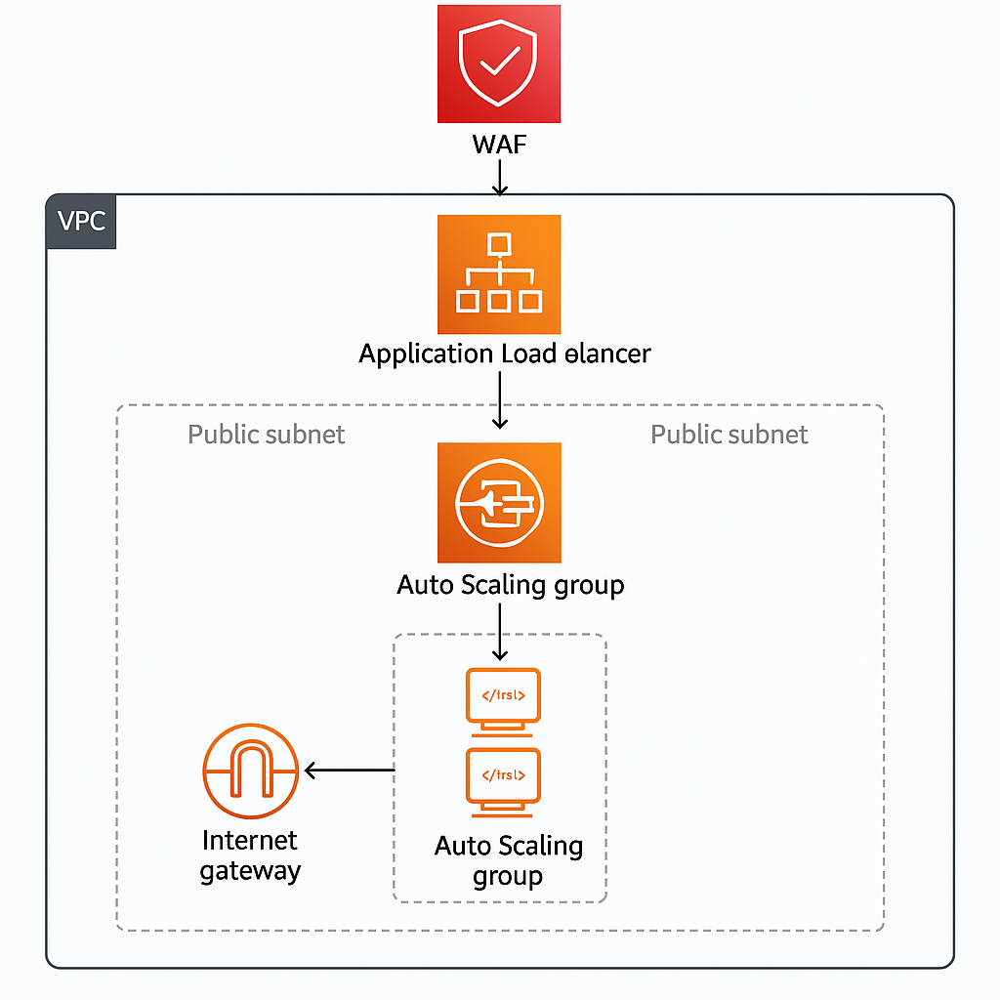

# Infraestructura Segura - TechDiversa

Este proyecto despliega infraestructura básica en AWS con:

- Auto Scaling Group (ASG)
- Application Load Balancer (ALB)
- Encriptación en reposo en EC2 (volumen EBS)
- Script de inicialización con Apache (user_data.sh)



## Características

- ALB distribuye tráfico entre múltiples instancias EC2 gestionadas por un ASG.
- Las instancias usan un Launch Template con volúmenes EBS cifrados.
- Incluye configuraciones de red, subredes públicas y routing.
- Código modular y reutilizable.

## ¿Por qué usamos dos subredes?

La arquitectura implementa dos subredes públicas, una en cada zona de disponibilidad (AZ) distinta dentro de la misma región (us-east-1a y us-east-1b). Esto responde a varias razones técnicas y de buenas prácticas:

### Alta disponibilidad (HA)

AWS recomienda usar múltiples zonas de disponibilidad para evitar que una falla regional afecte toda la aplicación. Al distribuir recursos entre subredes/AZs distintas:

- El tráfico puede continuar si una AZ falla.
- El Load Balancer (ALB) sigue operando sin interrupciones.

### Requisito del ALB

El Application Load Balancer (ALB) requiere al menos dos subredes en distintas AZs. Si solo se entrega una, Terraform lanzará un error y el ALB no se podrá desplegar correctamente.

### Auto Scaling efectivo

El Auto Scaling Group (ASG) puede lanzar instancias EC2 en cualquiera de las AZs disponibles. Esto permite:

- Distribuir la carga geográficamente.
- Reemplazar automáticamente instancias fallidas en otra zona.

### Mejora del rendimiento y tolerancia a fallos

Distribuir recursos entre subredes permite aprovechar los beneficios de redundancia, baja latencia y mayor confiabilidad, todo dentro de una región.

## ¿Por qué usamos un Application Load Balancer (ALB)?

El ALB actúa como la puerta de entrada a nuestra infraestructura web. Estas son sus ventajas:

- Distribuye tráfico automáticamente entre instancias del Auto Scaling Group.
- DNS fijo: aunque las instancias cambien, el dominio del ALB se mantiene.
- Monitoreo y métricas nativas con CloudWatch.
- Se puede integrar con WAF para protección L7 (HTTP/HTTPS).
- Soporta reglas avanzadas: redirecciones, path-based routing, etc.

> Nota: El ALB no cobra por instancias; solo por tiempo activo y tráfico manejado. En la capa gratuita, tienes 750h/mes por 12 meses.

## ¿Por qué incluir AWS WAF?

El WAF (Web Application Firewall) permite proteger tu aplicación web en capa 7 (HTTP) contra ataques como:

- Inyecciones SQL
- Cross-site scripting (XSS)
- Bots maliciosos
- Exceso de tráfico por IP (rate limiting)

Se configura por reglas personalizadas o mediante conjuntos predefinidos de AWS (Managed Rules).

> Importante: AWS WAF no está incluido en la capa gratuita, pero es altamente recomendable para producción.

Más info: [https://aws.amazon.com/waf/pricing](https://aws.amazon.com/waf/pricing)

## Instrucciones

```bash
terraform init
terraform apply
```

## Requisitos

- Cuenta AWS con permisos suficientes
- Terraform >= 1.0
